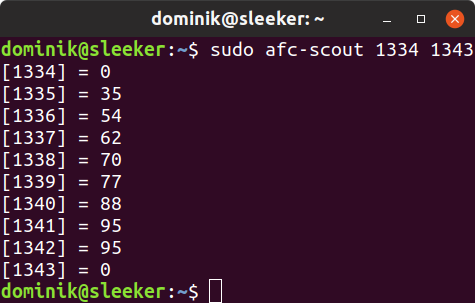

# afc-scout

[](https://github.com/dominiksalvet/afc-scout/commits)
[](https://github.com/dominiksalvet/gitpack)
[](https://github.com/RichardLitt/standard-readme)

> ACPI scout of asus-fan-control.

This is the ACPI scout of [asus-fan-control](https://github.com/dominiksalvet/asus-fan-control). Once a device is to be added to asus-fan-control as tested, something may not work out of the box. The problem is most likely caused by different base ACPI fan addresses of a target device.

This tool is very useful in those cases, which are referred to as advanced configuration in asus-fan-control. It helps to find the correct base addresses of a device by dumping ACPI address ranges. All numbers are in decimal form.

## Table of Contents

* [Install](#install)
  * [Dependencies](#dependencies)
* [Usage](#usage)
  * [Example](#example)
* [Questions](#questions)
* [Contributing](#contributing)
* [License](#license)

## Install

Afc-scout supports [GitPack](https://github.com/dominiksalvet/gitpack). Global installation/update:

```sh
sudo gitpack install github.com/dominiksalvet/afc-scout
```

### Dependencies

* **acpi_call** module (see [asus-fan-control](https://github.com/dominiksalvet/asus-fan-control))

## Usage

To dump **interesting ACPI address ranges**, use:

```sh
sudo afc-scout
```

If you want to use your own address range, use:

```
sudo afc-scout <start> <end>
```

### Example

<p align="center">
    
</p>

This example has been demonstrated on the UX430UA laptop model to detect the base ACPI fan address based on the values characteristics. As you can see, the base address might be 1335 with 8 temperatures (in fact [it is](https://github.com/dominiksalvet/asus-fan-control/blob/master/data/models#L1)).

> Note that the UX430UA model has only one base address as it has only one fan.

## Questions

If you have any questions, you can find out how to get them answered in [support.md](support.md) file.

## Contributing

Do you want to contribute somehow? Then [contributing.md](contributing.md) file is here for you.

## License

Afc-scout is licensed under the [MIT License](license).
